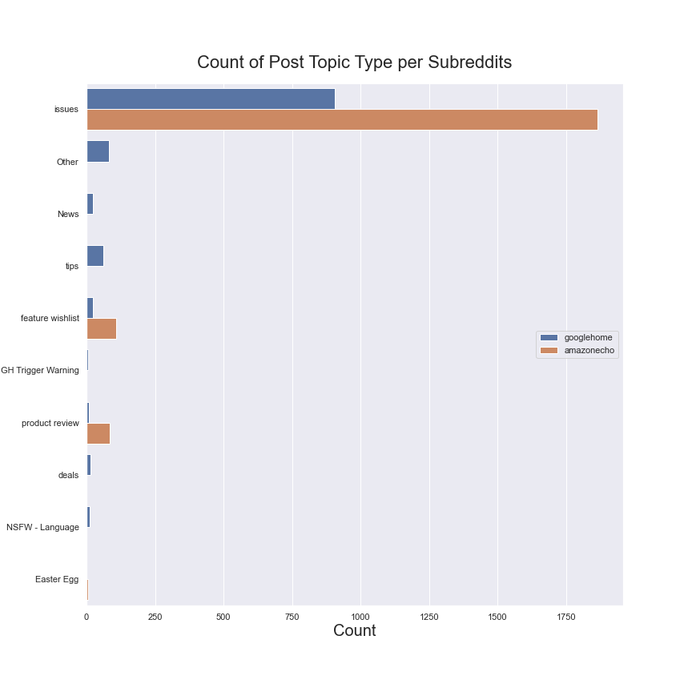
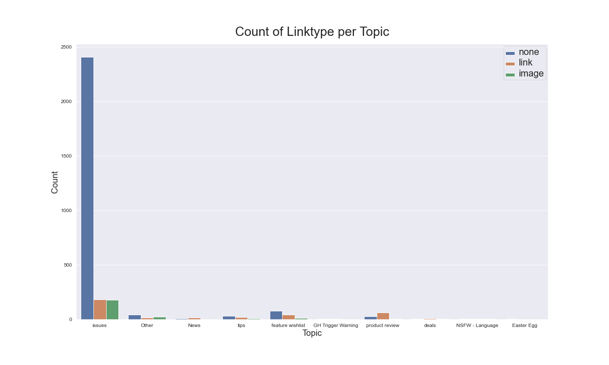
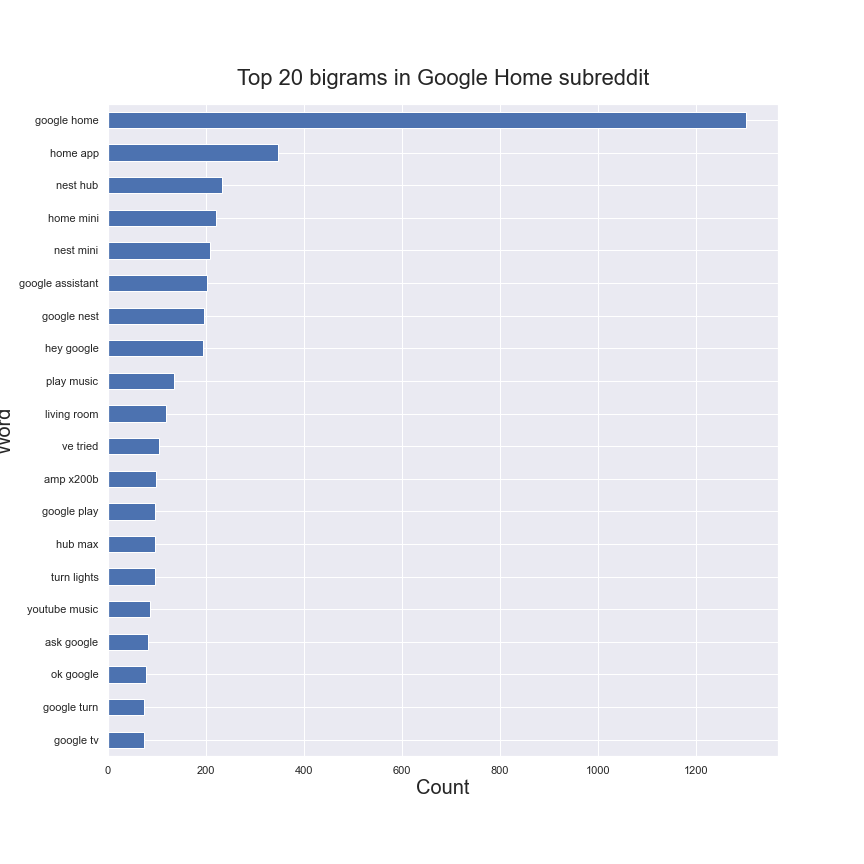
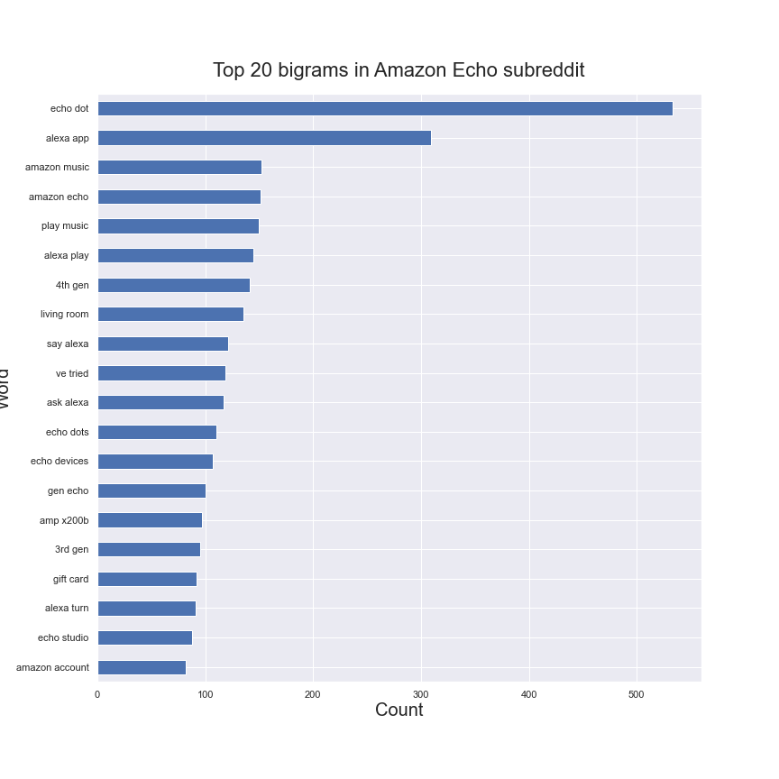
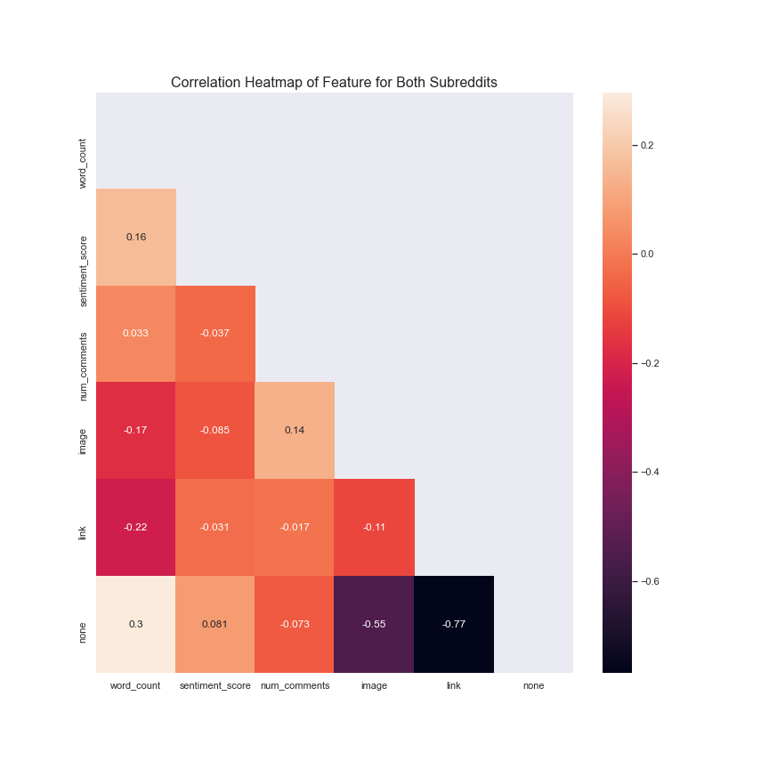

# Subreddit Post Classification (Google Home vs Amazon Echo)

## Problem Statement 

Google's smart speaker system, Google Home, was designed to compete with the popular Amazon Echo. Both product serve as a vehicle to their respective voice-activated virtual helper that connects to the internet. 

Reddit users have used the platform as a forum to discuss their experience with the products. I had been tasked by Google's Research team to analyze customer sentiment towards Google Home from subreddit posts on 'r/GoogleHome'.

Additionally the Research Team would also like to find out what common and unique customer pain points are prevalent between the Google Home and Amazon Echo, with the goal of designing a better product. Therefore subreddit posts from 'r/AmazonEcho' would also be included in the dataset.

A Random Forrest model would also be built to predict if a given set of words do in fact refer to the discussion of either the Amazon Echo or the Google Home based on selected features. 

Each subreddit post are represented as 'documents' in the dataset and therefore both terms will be used interchangebly.

## Executive Summary

Reddit is a social news aggregation, web content rating, and discussion website, recently including livestream content through Reddit Public Access Network. Registered members submit content to the site such as links, text posts, images, and videos, which are then voted up or down by other member.  This project aimed to compare between to subreddits, 'r/AmazonEcho' and 'r/GoogleHome'. The push shift Reddit API was used for scrapping, resulting in data collection of 3000 posts per subreddit. During data cleaning, 7.07% of the Google Home subreddit were spam posts, compared to 1.01% of Amazon Echo subreddit posts. 

In the Data exploratory analysis section, what was discovered was these subreddits had mainly been used as a platform for troubleshooting. Customer pain points were extracted based on frequency of bigrams. Software issues and device were common as well as voice command prompts. Recommendations were then made to Google's product research team to improve Google Home in these areas as well improve Google Support site. 

## Data Dictionary

|Feature|Type|Dataset|Description|
|---|---|---|---|
|sentiment_score|float|modelling_data|Measure of compound sentiment of a given document (ordinal)|
|word_count|intger|modelling_data|Number of words in the document|
|linktype|object|modelling_data|type of link found in the document|
|selftext_|object|modelling_data|post found on the subreddit|
|num_comments|integer|modelling_data|number of comments per post|
|subreddit_|object|modelling_data|which subreddit the document belongs to|

**Contents**
- [Data-collection](#Data-collection)
- [Data-cleaning](#Data-cleaning)
    - [Dropping posts regarded as spam](#Dropping-posts-regarded-as-spam)
    - [Feature engineering](#Feature-engineering)
- [Exploratory Data Analysis](#Exploratory-Data-Analysis)
    - [Forming inferences from missing data](Forming-inferences-from-missing-data)
    - [Investigate relationship between topic and linktype](#Investigate-relationship-between-topic-and-linktype)
    - [Check for links to customer support website or mention of site](#Check-for-links-to-customer-support-website-or-mention-of-site)
    - [Finding most frequently used words and bigrams](#Finding-most-frequently-used-words-and-bigrams)
    - [Sentiment Analysis with Vader lexicon](#Sentiment-Analysis-with-Vader-lexicon)
    - [Finding Correlation Between Features](#Finding-Correlation-Between-Features)
    - [Summary Statistic](#Summary-Statistic)
- [Modelling](#Modelling)
    - [Decision to only use Tfidvectorizer](#Decision-to-only-use-Tfidvectorizer)
    - [Model scores for stemmed data and lemmatized data](#Model-scores-for-stemmed-data-and-lemmatized-data)
    - [Test Random Forest algorithm on data without keywords](#Test-Random-Forest-algorithm-on-data-without-keywords)
    - [Include additional features to see if model improves](#Include-additional-features-to-see-if-model-improves)
    - [what can be learnt from the model selection](#what-can-be-learnt-from-the-model-selection)
- [COnclusion](#Conclusion)
- [Recommendations](#Recommendations)
- [Limitations](#Limitations)

## Data Collection & Cleaning

### Dropping posts regarded as spam

For this project the Pushshift Reddit API was used for scrapping 3000 posts per subreddit. This API was designed and created by the /r/datasets mod team to help provide enhanced functionality and search capabilities for searching Reddit comments and submissions. It was extremely easy to use as compared to Beautiful Soup and would recommended it to anybody doing a similar project.

The dataset was then cleaned by dropping posts that were had reoccuring urls. These posts tend to not have selftext and had variations of the same title whilst still written by unique authors. Majority of these urls were links to promotions or deals but were leaning towards 'spam' or even phishing sites. What is worth mentioning is  7.07% of the Google Home subreddit were these type of posts, compared to 1.01% of Amazon Echo subreddit posts.

These documents were thefore removed as they were not meaningful for out predictions.

### Feature engineering

Feature engineering had been done on values under the 'link_flair_text' category. Values like 'Question','Technical Issue', 'Help', 'Bug', 'Commands | How To's' and 'Alexa Skill' were binned together as 'issues' as they were mainly post associated with problems experienced with the respective product. Other values that had similar meanings were also binned togther and the category 'link_flair_text' was renamed to 'topic'.

Links found in 'selftext' and 'url_overridden_by_dest' where also given a new column called 'linktype' where any links found would be given either 'iamge','link' or 'none' value. This column would be used for further analysis by transforming them via one hot encoding to be trained on our model.

## Exploratory Data Analysis

### Forming inferences from missing data

917 documents from the Google Home subreddit and 765 documents from the Amazon Echo subreddit had titles but no self text. Additionally, 624 Google Home and 388 Amazon Echo posts were missing values under the topic column. The frequency of the topic were then plotted to see if there were insights to be discovered. 

### **Figure 1**

In Figure 1, we can form is that out of the 1012 post that had a topic assigned to them, majority of these posts were categorised as 'issues'. A potential inference we can make is the subreddits are mainly used as a platform for troubleshooting. 

Additionally, another inference that we can form, is posts that only had a title, were posts written by authors that felt it would be redundant to elaborate in 'selftext', as just the title would be self explanatory. Or instead of text, an image or url was used. These post were likely announcement, questions that were requesting for assistance via comments. Therefore as a form of feature engineering, these posts will have their titles copied into the selftext column to replace their null values. 

### Investigate relationship between topic and linktype
### **Figure 2**

Proving my inference, in Fig 2 we can see that images did fair the highest under issues assuming authors would share pictures regarding where their issues lie for easier troubleshooting. However compared to not having any types of links in their post, the bar chart above shows that majority of post were only text.

### Check for links to customer support website or mention of site

Moving forward with our analysis, as majority of posts were posts related to troubleshooting. Instinctively, phrases such as 'google support','amazon support' and their respective support sites were searched through every post to see the frequency of often they were mentioned. 

Rather suprisingly, authors do not mention customer support of the respective companies, it may indicate that the customer support sites are not very helpful in fixing the authors' issues with their products.

Out of 2968 posts, 'Google support' or its site had only been mention 31 times, approximately 1% of the time. And out of 2767 posts, 'Amazon support' or its site had only been mentioned 17 times, 0.6% times. 

### Finding most frequently used words and bigrams

After transforming our text data through the CountVectorizer, and counting their frequency to uncover common words did not find much useful insight as obvious ones such as 'Google' and 'Amazon' had ranked the highest, which is not very useful information. However words such as 'mini' which is a new google product appeared in the 20 common words for Google Home subreddit, similarly, 'dot', refering to the' Amazon Echo dot', as well in the Amazon Echo subreddit. Potentially pointing towards authors comparing the newer product models. 

Nonetheless, better inference need to be formed and thus we had ran through the text data through the Countvectorizer set the parameter to rank top 20 bigrams instead. 

### **Figure 3**

### **Figure 4**

From the above bar graphs, Figure 3 and 4, of the respective subreddits top 20 bigrams, it has uncovered customer pain points more clearly. 

For both subreddits, 'home app' and 'alexa app' appear, suggesting that most of the issues are software related. Additionally, bigrams such as 'hey google' and 'alexa play' shows issues with voice prompts as well as 'youtube music' and 'play music' shows issues with playing music. 

'Living room' also appears in both subreddits, suggesting that this is a common area for the placement of these products.

Furthermore in both subreddits, the mention of newer and older models are in the top 20, as well as other products that pairs with them. For example 'home mini' is the newer models for Google Home. And 'echo dot','4th gen','3rd gen' for Amazon Echo are both older and new models. 'Google Nest' and 'Nest Mini' are additional device to pair with the Google home. 

### Sentiment Analysis with Vader lexicon

Using Vader Lexicon, we had conducted a sentiment analysis as a way to quantify the average sentiment of posts per subreddits. Google Home had scored a mean compound score of 0.252 whilst Amazon Home scored 0.274. After which correlations were made between other numerical features. A correlation map was plotted to represent any existing relationships. 

### Finding Correlation Between Features
### **Figure 5**

From figure 5, we see most features have weak correlation relationships with each other. Num_comments has a positive relationship to image. Suggesting that people tend to engage more with post that includes pictures. Sentiment_score also have a negative relationship to image. This is likely due to authors posting issues with their product acompanied by an image.

Against my own intuition, sentiment_score has a postive relationship with number of words, I had expected a negative relationship as people tend to write lengthier posts when they are upset. Although this postivie relationship is still rather weak.

### Summary Statistic

|             	| No. of Posts 	| No.of post w/ image 	| No. of Post w/ link 	| Customer Support Mentioned 	| Words per Post 	| Average Sentiment 	|
|-------------	|--------------	|---------------------	|---------------------	|----------------------------	|----------------	|-------------------	|
| Google Home 	| 2968         	| 258                 	| 394                 	| 31                         	| 69             	| 0.252             	|
| Amazon Echo 	| 2767         	| 165                 	| 381                 	| 17                         	| 67             	| 0.274             	|
    

## Modelling
In this section, our clean data underwent further preprocessing using stemming and lemmatization. This processed data would then undergo a TFIDvectorizer transformer before training on Naive Bayes and Random Forest Models. is then processed with a TFIDvectorizer transformer before training on the Naive Bayes and Random Forest Models.

Additionally, the best algorithm, based on accuracy, would be selected and would also be tested against data that does not include key words and phrases such as 'Google Home' and 'Amazon Echo' just to name a few. 

### Decision to only use Tfidvectorizer
TfidVectorizer was chosen as the only preprocessing method to prepare our text data for out models. This decision is because CountVectorizer we only count the number of times a word appears in the document which results in biasing in favour of most frequent words. this ends up in ignoring rare words which could have helped in processing our data more efficiently.

In TfidfVectorizer, it considers overall document weightage of a word. It helps  in dealing with most frequent words. Using it will penalize them and therefore have an effect on keywords such as 'Google' and 'Amazon'.

### Model scores for stemmed data and lemmatized data

|             	| Lemmetized  	| Lemmetized    	| Stemmed     	| Stemmed       	|
|-------------	|-------------	|---------------	|-------------	|---------------	|
|             	| Naive Bayes 	| Random Forest 	| Naive Bayes 	| Random Forest 	|
| train score 	| 0.9530      	| 0.9967        	| 0.9544      	| 0.9965        	|
| test score  	| 0.8940      	| 0.9002        	| 0.8975      	| 0.9038        	|

The Random Forest algorithm performs the best, along with stemming as the text data preprocessing method of choice. 

Next we shall use Random Forest against text data that does not have obvious keywords like 'Google' and 'Amazon' etc.

### Test Random Forest algorithm on data without keywords
|             	| with keywords 	| without keywords 	|
|-------------	|---------------	|------------------	|
|             	| Random Forest 	| Random Forest    	|
| train score 	| 0.9965        	| 0.9988           	|
| test score  	| 0.9024        	| 0.8068           	|

As expected, the algorithm had performed worse with text data without key words, with 150 trees. A workaround to improve this model is to include additional features that were previous explored in our EDA, such as number of comments, link types and word counts. 

### Include additional features to see if model improves

|             	| with keywords 	| without keywords 	| without keywords and additional features 	|
|-------------	|---------------	|------------------	|------------------------------------------	|
|             	| Random Forest 	| Random Forest    	| Random Forest                            	|
| train score 	| 0.9965        	| 0.9988           	| 0.9988|
| test score  	| 0.9024        	| 0.8068           	| 0.8242                                  	|

Our Random Forest Model, with the same parameters ie. 150 trees, performed significantly better with a higher score.

What can be concluded is that the features added into our model was extremely useful in the classification of the post to the right subreddits.

### what can be learnt from the model selection

Stemming our text data had resulted in better accuracy score across our Naive Bayes and Random Forest model. This is likely due to the nature of our problem, where we are simply classifying which post belonged to which subreddit. The application of lemmatization is better suited for more complex task such as building a language application where sesitivity to language inflections is important, which also may have been the reason for lower accuracy score. 

Our Random Forest model had also performed better than Naive Bayes overall. A possible reason would be the conditions the Naive Bayes model requires for it to work well. Naive Bayes works best when you have small training data set and relatively small features(dimensions). Since we have very high dimensionality, the model may not give you accuracy, because the likelihood would be distributed and may not follow the Gaussian or other distribution. Another condition for Naive Bayes to work is that features should be dependent of each other and with text data, there is a likelihood that certain words are dependent of each other, for example bigrams or trigrams. 

Lastly, our Random Forest performed better with additional features, this is representative of how with more data, lowers estimation variance.

## Conclusion

From our topic type bar graph, majority of topic discussion is regarding trouble shooting problems they are facing with the product. Additionally from our top 20 bigram bar graph, we see that the Google Home Mini is often mentioned. Suggesting that people are comparing their Google Home to the Home Mini, most likely weighing the pros and cons between them. This also applies to Amazon Echo and the Echo Dot. 

When searching for key words such as 'Google Support' and 'support.google.com' only 31 times out of 2968 posts, approximately 1%, compared to Amazon of 0.6%. This may show that owners of the Google Home either have tried Google's customer support and do not find it useful to suggest it as a solution to other owners. An alternative inference is authors that have mentioned customer support are lamenting their experience. 

From the sentiment analysis, on average Amazon echo has a higher compound score, although marginal.

## Recommendations
Areas where our the Google Home can be improved are software issues, related to playing music mostly such as apple and youtube music based on the most common words. Also pairing with the lenovo smart clock as the bigram seem to appear frequently. Voice command prompts seem to be mentioned often as well, this evident in both subreddits which suggest it is a common issue amongst the products. 

Google's research team can learn from these posts to improve Google Support site. Although it may not directly relate to increase in revenue, instead of having to resort to looking for solutions on a subreddit where they may not always have your issue addressed as it is highly dependent if people reply to you post.

This would also help with customer retention and therefore boosting sales and revenue.

## Limitations
In terms of modelling, The model had been trained on data that have been cleaned and preprocessed. Post that were regarded as 'spam' post were removed, in order to ensure accurate predictions. Which had been 7% of the initial data scraped from the Google Home subreddit. The models tested had not been trained on these types of posts, therefore the model may do poorly when prediciting the right subreddit when fed posts like these. 

Training the model with spam post may yield different results and would be interesting to test.
    
